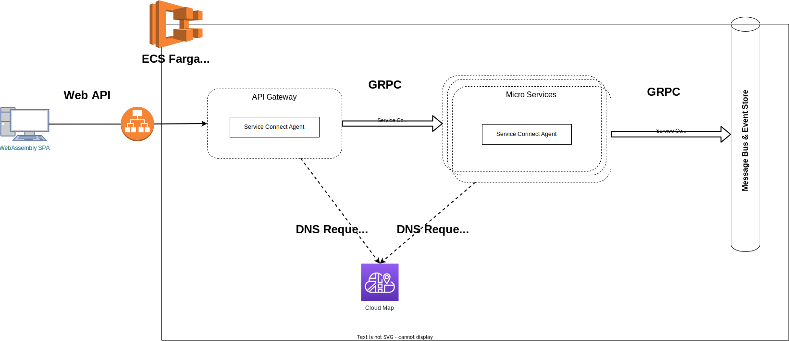

# inaba
CQRS/ESなマイクロサービスで作るECサイト

## 参照
* [ドメインストーミング](https://miro.com/app/board/uXjVM1s4A4A=/)
* [Terraform](https://github.com/azarasi1226/inaba-infrastructure)

## システム構成
### サービス構成


### サービス間トラフィック


### インフラ構成


<br>

## Local環境構築手順
### 1. Dockerによる環境構築
docker-composeを使用してインフラ構築をします。
```bash
cd ./setup/docker
docker compose up -d
```
<br>

### 2. Cognitoの初期セットアップ
シェルスクリプトを叩いてUserPoolとUserPoolClientを作成します。
```bash
./cognito-setup.sh
```
```
CognitoUserPoolを作成します...
CognitoUserPoolId:[local_2nKkO2sg]を作成しました
CognitoUserPoolClientを作成します...
CognitoUserPoolClientId:[d14m44wivtx2lvonzzz7n8f4t]を作成しました
```
下記二つのIDをどこかにコピーしてください。
* CognitoUserPoolId *(例 : local_2nKk02sg)*
* CognitoUserPoolClientId *(例 : d14m44wivtx2lvonzzz7n8f4t)*

<br>

### 3. KMSの初期セットアップ
TODO()

<br>

### 3. AxonServerの起動
* [AxonServer Console](http://localhost:8024/)にアクセスして、defualt contextを手動で作成します。

<br>

### 4. サービス起動
以下の環境変数をセットし、サービスを起動します。  
InteliJ IDEAのマルチプロジェクト機能を使えばすべてまとめて起動できるので検証が楽です。


#### OrderService環境変数
```
SERVER_PORT=8081;
SPRING_DATASOURCE_DATABASE=order;
SPRING_DATASOURCE_HOST=localhost;
SPRING_DATASOURCE_PASSWORD=passw0rd;
SPRING_DATASOURCE_PORT=3306;
SPRING_DATASOURCE_USERNAME=root;
SPRING_PROFILES_ACTIVE=local;
```

#### CatalogService環境変数
```
SERVER_PORT=8082;
SPRING_DATASOURCE_DATABASE=catalog;
SPRING_DATASOURCE_HOST=localhost;
SPRING_DATASOURCE_PASSWORD=passw0rd;
SPRING_DATASOURCE_PORT=3306;
SPRING_DATASOURCE_USERNAME=root;
SPRING_PROFILES_ACTIVE=local;
```

#### BasketService環境変数
```
SERVER_PORT=8083;
SPRING_DATASOURCE_DATABASE=basket;
SPRING_DATASOURCE_HOST=localhost;
SPRING_DATASOURCE_PASSWORD=passw0rd;
SPRING_DATASOURCE_PORT=3306;
SPRING_DATASOURCE_USERNAME=root;
SPRING_PROFILES_ACTIVE=local;
```

#### IdentityService環境変数
```
SERVER_PORT=8084;
SPRING_DATASOURCE_DATABASE=identity;
SPRING_DATASOURCE_HOST=localhost;
SPRING_DATASOURCE_PASSWORD=passw0rd;
SPRING_DATASOURCE_PORT=3306;
SPRING_DATASOURCE_USERNAME=root;
SPRING_PROFILES_ACTIVE=local;
AWS_COGNITO_USER-POOL-ID={さっきコピーした奴};
AWS_COGNITO_CLIENT-ID={さっきコピーした奴};
```

### DataKeyService環境変数
```
SERVER_PORT=8085;
SPRING_DATASOURCE_DATABASE=datakey;
SPRING_DATASOURCE_HOST=localhost;
SPRING_DATASOURCE_PASSWORD=passw0rd;
SPRING_DATASOURCE_PORT=3306;
SPRING_DATASOURCE_USERNAME=root;
SPRING_PROFILES_ACTIVE=local;
AWS_KMS_MASTER-KEY_ID={さっきコピーしたやつ}
```

## Services
* [AxonServer Console](http://localhost:8024/)
* [OrderService Swagger](http://localhost:8081/swagger-ui/index.html)
* [CatalogService Swagger](http://localhost:8082/swagger-ui/index.html)
* [BasketService Swagger](http://localhost:8083/swagger-ui/index.html)
* [IdentityService Swagger](http://localhost:8084/swagger-ui/index.html)